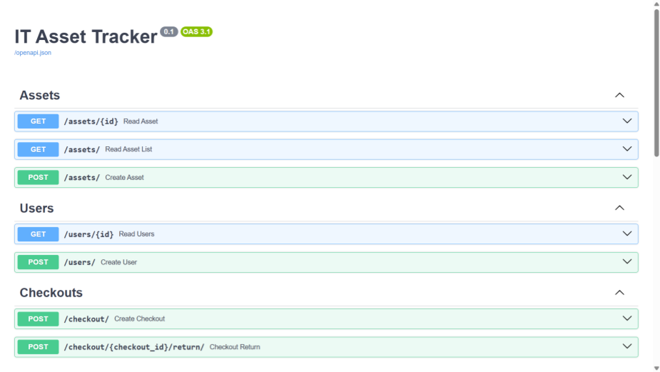

# IT Asset Tracker API

A lightweight **IT asset management REST API** built with **FastAPI**.

This project simulates a system used by IT departments to track devices, manage users, and monitor equipment checkouts. The API allows administrators to create assets, register users, and track which devices are currently loaned out.

> **Note:** This project currently uses in-memory storage for simplicity.
> Future versions will introduce persistent database storage.


# Features

* Asset inventory management
* User management
* Device checkout system
* Asset return tracking
* RESTful API design
* Automatic API documentation with FastAPI


# Tech Stack

* **Python**
* **FastAPI**
* **Pydantic**
* **Uvicorn**


# Data Storage

The current version of the API uses **in-memory Python lists** to store assets, users, and checkout records.

This allows the API to run immediately without requiring a database setup.

Because the data is stored in memory, all records are **reset when the server restarts**.

Database persistence (SQLite) is planned for a future version of the project.


# Project Structure

```
it-asset-tracker/
│
├── app/
│   ├── main.py            # FastAPI app initialization
│   ├── models.py          # Data models
│   ├── crud.py            # Business logic and in-memory storage
│   └── routers/
│       ├── assets.py      # Asset endpoints
│       ├── users.py       # User endpoints
│       └── checkouts.py   # Checkout endpoints
│
├── requirements.txt
└── README.md
```

This modular structure separates:

* API routing
* business logic
* data models

This approach improves maintainability and makes the project easier to extend with features like database integration or authentication.


# Installation

Clone the repository:

```bash
git clone https://github.com/jack-gutierrez/it-asset-tracker.git
cd it-asset-tracker
```

Install dependencies:

```bash
pip install -r requirements.txt
```

Start the FastAPI server:

```bash
uvicorn app.main:app --reload
```

The API will now be running at:

```
http://127.0.0.1:8000
```
## Interactive API Documentation

The API includes automatically generated documentation.




# Running the Project

Once the server is running, open the interactive API documentation:

```
http://127.0.0.1:8000/docs
```

From there you can:

* create assets
* create users
* check out devices
* return devices

No additional setup or database configuration is required.


# Example API Request

Create a new asset:

```bash
curl -X POST "http://127.0.0.1:8000/assets" \
-H "Content-Type: application/json" \
-d '{
  "id": 1,
  "asset_tag": "A100",
  "device_type": "Laptop",
  "make": "Dell",
  "model": "XPS 13",
  "serial_number": "123ABC"
}'
```

# Example Workflow

1. Create a user
2. Create an asset
3. Check out the asset to the user
4. Return the asset

All steps can be tested directly through the Swagger UI.


# Current Version

**v0.1 — MVP**

Current version includes:

* Core REST API endpoints
* In-memory list-based data storage
* Asset checkout and return logic
* Interactive API documentation


# Roadmap

Planned improvements:

* Add **SQLite database persistence**
* Implement **authentication**
* Build a **web dashboard UI**
* Add **Docker support**
* Add automated testing


# Learning Goals

This project was built to practice:

* Backend API design
* REST architecture
* FastAPI framework
* Python application structure
* building modular backend services
